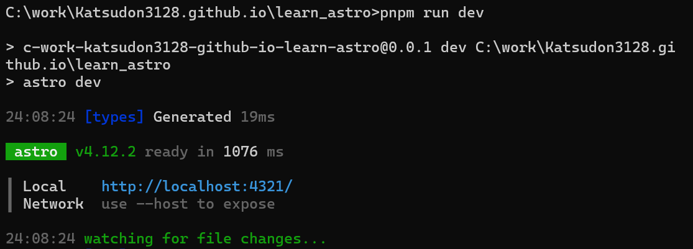
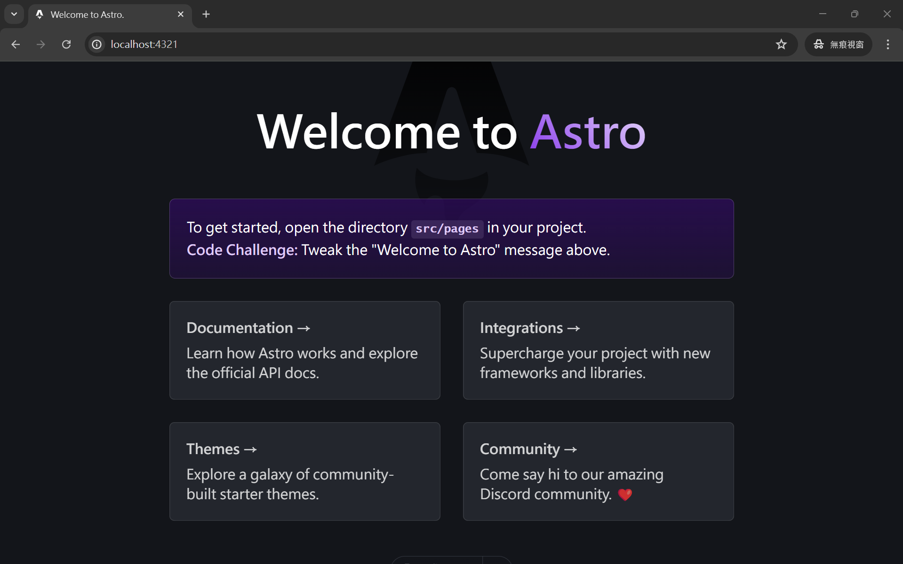

一開始會接觸到 Astro 是因為，想要創建一個個人網站，這是從我開始當工程師以來就一直想做的事(應該很多人也是吧?)，後來偶然在 github 上發現一個blog模板(也是我現在用的)，簡潔順暢的介面吸引到我，又是新語言!馬上fork下來研究研究，因此才有了這篇文，也算是幫自己整理所學。

# Astro是什麼？
根據[官網](https://docs.astro.build/zh-tw/concepts/why-astro/ "why-astro")的描述，Astro 是一個 web 框架，用於打造以內容為中心的網站，從他們的設計理念就可以發現，對網頁效能的追求。

### 特色
- 群島：以元件為基礎的 web 架構，專為以內容為中心的網站設計。
- 跨 UI 框架：支援 React、Preact、Svelte、Vue、Solid、Lit、HTMX、web component 等。
- 伺服器優先：避免在客戶端執行耗費資源的算繪。
- 預設零 JS：減少拖慢網站速度的客戶端 JavaScript。
- 內容合集：統一管理、驗證 Markdown 內容，同時提供 TypeScript 型別安全。
- 客製化：Tailwind、MDX 等數以百計的整合任君挑選。

### 設計理念
1. 以內容為主：Astro 專為內容豐富的網站設計。
2. 伺服器優先：由伺服器算繪 HTML 的網站會執行得更加快速。
3. 預設即迅速：不太可能用 Astro 寫出緩慢的網站。
4. 簡單易使用：你不需要是專家，也能用 Astro。
5. 注重開發者：你應該享有成功打造網站的所需資源。

<br/>

# 環境建置
>先確認有安裝 Node.js，版本 v18.17.1 或 v20.3.0 或更高。

執行以下指令創建Astro專案，照著問題回答即可，這邊我使用pnpm，若無可執行`npm install -g pnpm`安裝或用npm也行
```
pnpm create astro@latest
```
完成後應該會在資料夾生成專案檔案   
Astro內建開發伺服器，在專案目錄執行以下指令
```
pnpm run dev
```

接著連到<http://localhost:4321/>  

現在網站已經可以運行囉！  
如果要停止按下CTRL+C就可以了