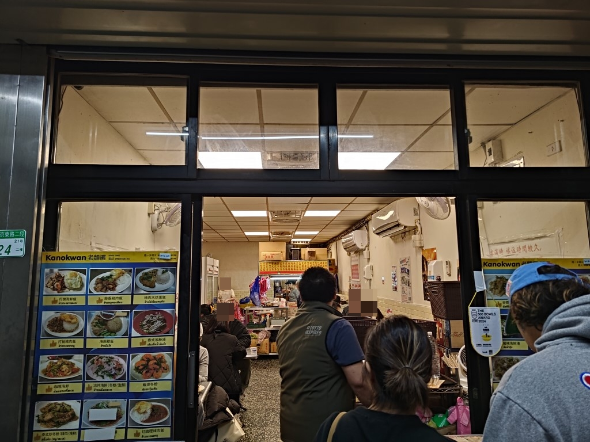

**Kanokwan 老麵攤** 這間店其實放在我的口袋名單許久，但一直沒有機會去吃

剛好最近搬新家發現他就在附近!就趁著元旦這一天有空去吃一波囉~~~

# 店家資訊

### Kanokwan 老麵攤
### 地址：<a href="https://maps.app.goo.gl/4rcAu3B4c5B2ZFJEA" target="_blank">台北市中山區南京東路二段21巷24號1樓</a>
### 營業時間：10:30–20:30，週日公休
### 用餐流程：門口排隊點餐付款>取號碼牌>叫號入座

今天是晚上大約七點半到，現場排隊人潮不少大約十幾個人，但聽說這不是最多的，店面非常老舊，看起來就是很不起眼的小店XD，如果不是別人推薦我真的不會走進去

店員看起來像是泰國華僑的感覺，感覺就像來到泰國(?)，店面不算大但內外都擺滿座位，加上人多所以顯得格外壅擠，但亂中有序的樣子很有東南亞的感覺XD

先在門口排隊點餐，可以先去前面拿菜單邊排隊邊看，這樣才不會在點餐檯點太久，因為菜單的品項真的很多，點完付款後就會拿到號碼牌，接著就等他叫號就可以入座囉!這次大概等了4組約15分鐘，好像還算蠻快的~

店內空間也不大，而且料理區居然是一個攤車，不知道是不是曾經在外面擺攤過

# 菜單

沒有月亮蝦餅，是真的泰國菜:D

要注意紅字的品項一定會辣，怕辣的人要注意

# 餐點

## 涼拌木瓜絲 NT$110

這道是我去泰式餐廳一定會點的前菜，酸酸辣辣的很開胃!這裡的木瓜絲也是在水準之上

## 炒泡麵(海鮮) NT$205

來這裡就是為了他!麵條硬度剛好不會軟爛，蔬菜清脆沒有出水，蝦子魷魚炒得入味不會有分離感，重點是他有炒出鍋氣!!!雖然炒泡麵很難做的難吃，但是要做的這麼好吃也是很不容易的!

## 酒鬼炒泡麵 NT$120

一樣的炒泡麵水準，但是吃起來有冬蔭功的味道，而且會辣，但對能吃辣的人來說應該還好

## 貢丸蛋花湯 NT$50

湯就比較普通，後來才發現這道是放在菜單上的台式料理XD

總體來說泰式料理都很好吃，他的份量稍微小一點，對食量不大的人來說應該算剛好，但最好2-4個人去可以點比較多樣菜一起分，至於用餐環境算是小扣分，比較髒亂一點，地板跟牆壁感覺很久沒清乾淨，不過聽老闆說這間店就快要搬家了，之後就不會在這裡，所以也是可以期待一下之後新的店面喔!