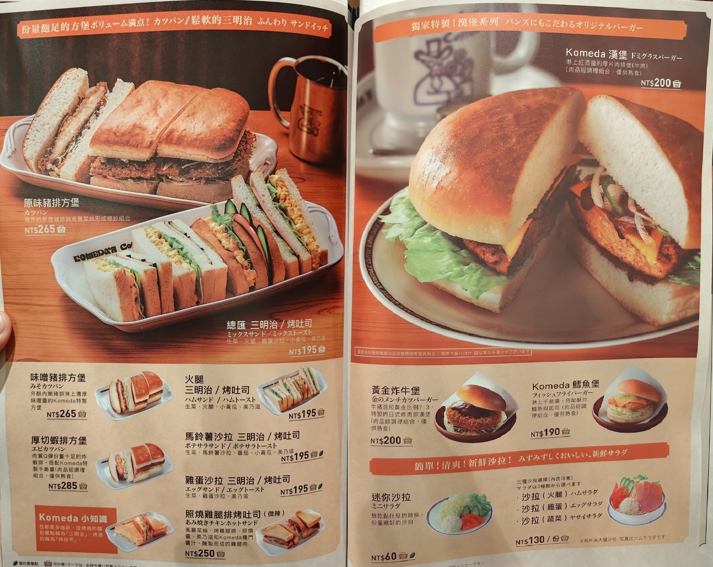
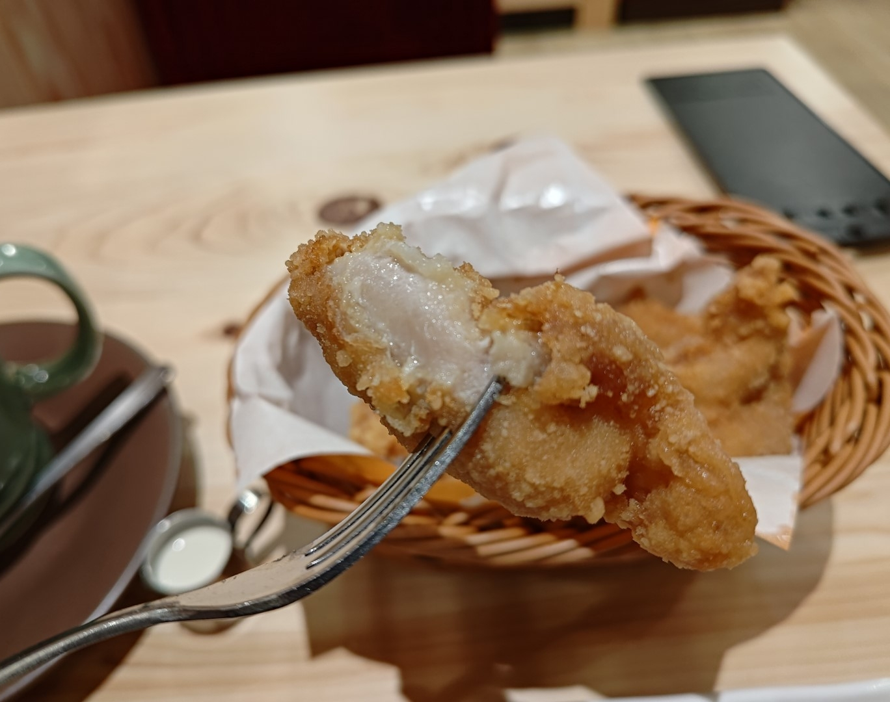
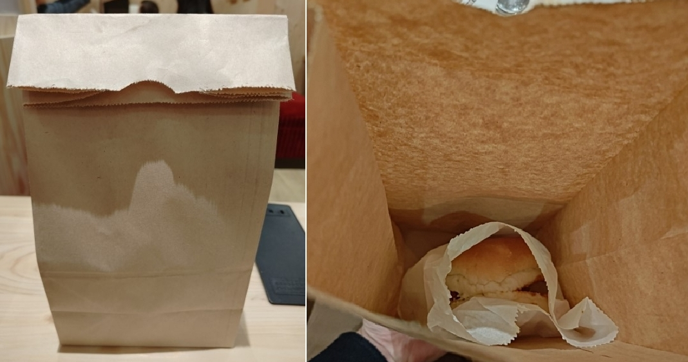

**客美多咖啡 Komeda‘s Coffee** 是來自名古屋的老牌連鎖咖啡廳

以圖片和份量的差異聞名，實際上份量都超大~~~

目前在台灣已經開了33間店，地點遍布全台包含雙北、基隆、桃園、新竹、台中、嘉義、台南、高雄

另外還有兩間籌備中位於誠品站前及台北轉運站，可望減緩排隊人潮

# 店家資訊

### 客美多咖啡 Komeda‘s Coffee - 林森店
### 地址：<a href="https://maps.app.goo.gl/fmmmJJzFwGmhEugt8" target="_blank">台北市中山區南京東路一段52號</a>
### 營業時間：07:30–21:00
### 有WIFI、個人插座、廁所
### 時間限制：基本2小時
### 用餐流程：排隊帶位>按鈴點餐>吃完後結帳

這間位於中山捷運站附近，走路5分鐘非常近，其實中山北路上還有一間差不多近的中山店，但因排隊人潮眾多所以林森店也是一個好選擇，由於客美多是以現場候位為主，需要趕時間或不喜等待的人最好挑離峰時間去比較不會打亂行程喔!

今天是大約中午12點來，現場沒有人排隊直接就帶位入座了~

林森店的店內空間不大，但還是保留一定比例的單人座位，真的是一個人吃飯的福音QQ

每個座位也都有插座，以及免費WIFI上網，在這裡辦公做作業完全沒問題!

狹長型空間走到底就是廁所，裡面有分男女兩間，整體很乾淨舒適

這次被安排在兩人座位，所以即使一人用餐還是蠻快就能入座的!

# 菜單
## 咖啡

## 點心飲品

## 茶與甜點

## 主食

以咖啡廳來說，餐點種類非常多，連日本網友都說客美多是吃飯的地方XD

## 早餐

名古屋特色點飲料送早餐，在早上11點以前點飲料就可以選其中一種吐司口味喔!

另外有期間限定的布丁狗聯名餐點，但怕太甜這次就沒嘗試了XD

# 餐點

點餐只要按下服務鈴，店員就會很快的回應你，即是他們可能正在忙，服務還算不錯~

## 美式咖啡 NT$115

點餐後約5分鐘就上了，會附一小壺鮮奶油怕苦的可以加，但其實這杯美式非常順口!不苦澀又香氣十足，跟自己泡的完全不一樣!

早上11點過後點咖啡雖然沒有免費早餐，但會附小點心，今天拿到花生:D

## 味噌豬排方堡 NT$265

超巨大!目測大概兩個大麥克的份量，方堡麵包夾著滿滿的炸豬排、高麗菜絲、青椒絲，豬排口感偏鬆軟，介於漢堡排和烤肉排之間，味噌醬則偏甜，整體很不錯

## 炸雞塊 6塊 NT$160

這道激推!!!炸雞不乾，沒有多餘的調味只有淡淡的鹹味加上檸檬解膩，會忍不住直接吃完XD，還好一個人吃不用跟別人搶(X)，個人認為客美多炸雞塊絕對是必點的第一名

## 冰與火 NT$170

客美多的經典甜點，底下是烤的鬆軟的丹麥麵包，放上霜淇淋一起吃，菜單還強調是職人技術高達64層的丹麥麵包，看起來好像很厲害XD

麵包內有夾奶油，味道是很濃郁的奶香，口感也很鬆軟確實層次很豐富，霜淇淋偏濕軟，非常甜，味道像是煉乳的感覺，整體來說螞蟻人應該會很愛，但我不是所以就先不推了XD，怕甜的話可以少沾一些霜淇淋，單吃麵包就很夠味，或是請螞蟻人朋友先吃掉霜淇淋

## 打包
因為分量實在太多吃不完，所以可以打包!

但要注意一點就是菜單上有註記 **take out** 的餐點才能打包喔!

這次點下來總金額為$781含服務費，價位是中等偏高的，但這樣的店內環境及餐點美味程度，還算是物有所值的!
